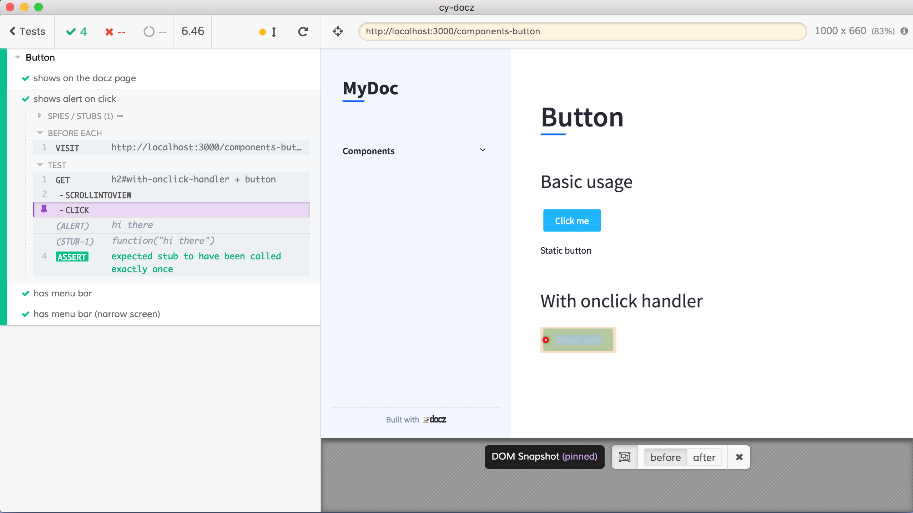

# cy-docz
> Live, tested documentation using MDX [docz](https://www.docz.site/) and [Cypress.io](https://www.cypress.io)

- `npm install`
- `npm t` - runs local docz site and executes end-to-end tests against them using Cypres

To see documentation

- `npm run dev` and `open http://localhost:3000`

While the docz are running, open Cypress with `npm run cy:open` and click on `spec.js` to run tests

See all components and their `.mdx` documentation files in [components](components) and the end-to-end tests in [cypress/integration/spec.js](cypress/integration/spec.js)
